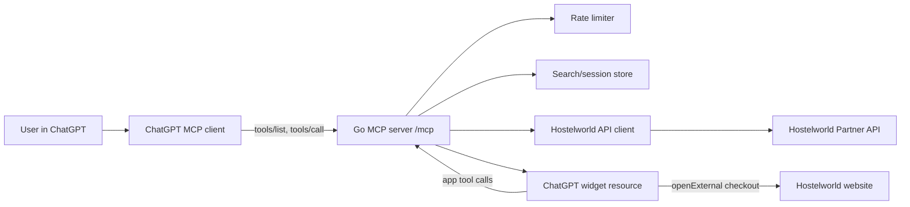
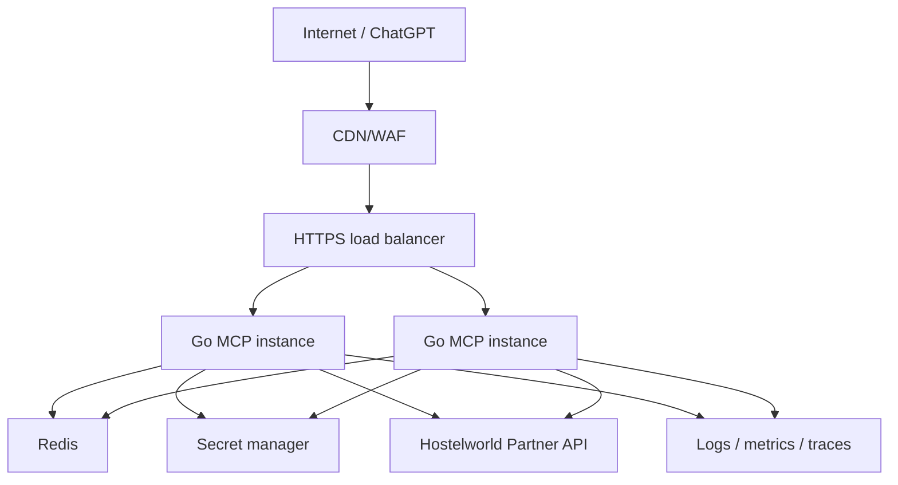

# Hostelworld MCP Design

Date: 2026-04-29

Status: planning draft, no implementation started

## Goal

Build a Go-based MCP server for Hostelworld search and checkout handoff that can be used from OpenAI surfaces, especially ChatGPT Apps/connectors. The target interaction is:

1. User asks: "@hostelworld I would like to book a hostel in Lisbon for 2 guests from 2026-07-10 to 2026-07-14."
2. ChatGPT calls the Hostelworld MCP.
3. The MCP calls the Hostelworld Partner API and returns a small set of available properties.
4. The user clicks a property card.
5. The app shows rooms/rates for that property.
6. The user selects a room/rate.
7. The MCP generates a Hostelworld checkout link and opens Hostelworld for payment.
8. If the user asks for more results, already shown properties are excluded.

The MCP must not expose Hostelworld API credentials, must not process card data, and must rate limit aggressively enough to protect both our service and the Hostelworld API allocation.

## Sources Checked

- Hostelworld Partner API Swagger UI: https://partner-api.hostelworld.com/
- Hostelworld Property Location Search docs: https://partner-api.hostelworld.com/#/Property%20Location%20Search/PropertyLocationSearchController_getPropertyLocationSearch
- Hostelworld affiliate solutions page: https://partners.hostelworld.com/solutions/
- Hostelworld affiliate FAQ: https://partners.hostelworld.com/faqs/
- OpenAI Apps SDK MCP overview: https://developers.openai.com/apps-sdk/concepts/mcp-server
- OpenAI Apps SDK MCP server guide: https://developers.openai.com/apps-sdk/build/mcp-server
- OpenAI Apps SDK auth guide: https://developers.openai.com/apps-sdk/build/auth
- OpenAI Apps SDK state guide: https://developers.openai.com/apps-sdk/build/state-management
- OpenAI Apps SDK security and privacy guide: https://developers.openai.com/apps-sdk/guides/security-privacy
- OpenAI Apps SDK connect from ChatGPT guide: https://developers.openai.com/apps-sdk/deploy/connect-chatgpt
- MCP transports spec: https://modelcontextprotocol.io/specification/2025-06-18/basic/transports
- MCP tools spec: https://modelcontextprotocol.io/specification/2025-06-18/server/tools
- MCP security best practices: https://modelcontextprotocol.io/docs/tutorials/security/security_best_practices
- Official MCP Go SDK: https://github.com/modelcontextprotocol/go-sdk

## Assumptions

- We have or can obtain official Hostelworld Partner API credentials. Hostelworld says API access is offered case by case, so production depends on partner approval.
- The public Swagger UI is accurate for the current Partner API version. The embedded spec reports version `2.7.7.22`.
- The public docs do not explain the exact `consumer_signature` algorithm. We must get the signing algorithm and test vectors from Hostelworld before production.
- Payment will happen on Hostelworld, not inside our MCP. The MCP will generate a checkout link and hand the user to Hostelworld.
- We are building a remote HTTP MCP server for OpenAI/ChatGPT, not a local-only stdio server.
- We will use Go for the MCP/backend. A small web UI bundle may still be needed for clickable ChatGPT cards.

## Non-Goals

- Do not collect payment details.
- Do not scrape Hostelworld checkout pages.
- Do not automate browser payment.
- Do not store raw prompts or unnecessary traveler PII.
- Do not build speculative property ingestion or personalization until the live search flow works.
- Do not expose a public API proxy that lets arbitrary clients call Hostelworld through our credentials.

## Success Criteria

- ChatGPT can discover the connector and call `search_hostels` from a natural-language prompt.
- Search returns available properties for city, date range, guest count, currency, and optional filters.
- "Show me more" returns additional properties without repeating previously shown properties for that search.
- Selecting a property shows room/rate options verified against the selected dates.
- Selecting a room/rate produces a Hostelworld checkout URL, and payment remains on Hostelworld.
- No tool output, UI payload, client-side network request, log line, trace attribute, or error response exposes `consumer_key`, `consumer_signature`, or API secret material.
- Abuse protections work before traffic reaches Hostelworld: per-user rate limits, global outbound rate limits, cache, request validation, and circuit breakers.
- The flow can be tested with fake Hostelworld fixtures, MCP Inspector, and ChatGPT developer mode.

## Recommended Approach

Use a Go service that exposes a Streamable HTTP MCP endpoint at `/mcp`, serves a ChatGPT Apps UI resource for clickable cards, and calls Hostelworld server-side only.

Why this is the best fit:

- OpenAI Apps SDK uses MCP as the server/model/UI contract.
- MCP can return structured tool data for the model and larger widget-only metadata for the UI.
- The official MCP Go SDK exists and supports building MCP clients/servers in Go.
- Streamable HTTP is the recommended remote transport for Apps SDK.
- A widget is the cleanest way to support "click hostel", "view rooms", and "checkout" without turning the whole flow into text.
- Server-side Hostelworld calls keep credentials out of ChatGPT, browsers, and user-visible URLs.

## Key Hostelworld API Shape

The public Swagger UI embeds the OpenAPI contract. Important endpoints:

| Need | Endpoint | Notes |
| --- | --- | --- |
| Search by city/date | `GET /propertylocationsearch.json` | Searches available rooms in a city/country for check-in/check-out dates. Supports `City`, `Country`, `CityNO`, `DateStart`, `DateEnd` or `NumNights`, `Currency`, sorting, property type filters, facilities, review count, and `ShowRoomTypeInfo`. |
| Search known properties | `GET /propertyavailabilitysearch.json` | Gets availability for up to 10 explicit property numbers. Useful for revalidating selected or recommended properties. |
| Room/rate details | `GET /propertybookinginformation.json` | Gets cheapest bookable rate for each room in a property. Docs explicitly say to set `ShowRoomTypeInfo` bit `2` for fully bookable rooms and bit `8192` to get room/rate IDs for property links. `8258 = 2 + 64 + 8192` gives fully bookable rooms, prices, and room/rate IDs. |
| Website/checkout link | `GET /propertylinks.json` | Returns affiliate links to microsite, availability, and checkout. Checkout link can only be generated when exactly one property number is passed. For checkout, provide dates, `RoomId1`, `RatePlanId1`, `Persons1`, and `Currency`. |
| Property details | `GET /propertyinformation.json` | Descriptions, images, policies, facilities, contact details. Use when the user opens a property details view. |

Important API observations:

- Auth is query-based: `consumer_key` and `consumer_signature`.
- `consumer_signature` is described as calculated from an API secret, but the algorithm is not in the public Swagger contract.
- Responses include API metadata such as `status`, `callsremaining`, and `version`.
- Location search does not expose a standard page/offset parameter in the public spec. "More results" should therefore use our cached ranked result set and a seen-property set.
- The normal non-group search endpoint does not appear to have a simple `Guests` parameter. We should search by availability/date/location, then filter/verify room suitability from `roomTypes`, `maxPax`, and `PropertyBookingInformation`.
- Group search has dedicated fields such as `GroupSearch`, `GroupSize`, `GroupType`, and `GroupAgeRanges`, with `GroupSize` documented as greater than 8.

## OpenAI/MCP Integration Shape

Use ChatGPT Apps/connectors as the primary integration:

- The MCP server advertises tools with names, descriptions, JSON input schemas, optional output schemas, and UI metadata.
- Tool handlers return:
  - `structuredContent`: concise JSON the model can inspect.
  - `content`: short user-facing/model narration.
  - `_meta`: larger widget-only details. OpenAI docs state `_meta` does not reach the model, but we still must not put secrets there.
- The widget resource is served as `text/html;profile=mcp-app`.
- The widget can call app-visible tools directly for actions like "show rooms", "more", and "checkout link".
- Use `_meta.ui.csp` to allow only exact required domains.
- For local testing, ChatGPT developer mode requires a public HTTPS URL for the `/mcp` endpoint, usually through a tunnel.

Transport:

- Chosen: Streamable HTTP at `/mcp`.
- Keep stdio support as a developer-only option later if useful.
- Enforce MCP transport security requirements:
  - Validate `Origin`.
  - Require HTTPS in production.
  - Authenticate remote clients.
  - Use request size limits, timeouts, and session cleanup.

## Proposed Tool Surface

### `search_hostels`

Purpose: Search available hostels/properties for a user trip.

Model visibility: model and app.

Inputs:

| Field | Required | Notes |
| --- | --- | --- |
| `city` | yes | Full city name. |
| `country` | recommended | Required when city is ambiguous. |
| `check_in` | yes | ISO date. |
| `check_out` | yes | ISO date, exclusive checkout date. |
| `guests` | yes | Integer, 1 to configured max. |
| `currency` | no | ISO currency, default from user locale or `USD`. |
| `language` | no | Hostelworld supported language, default `English`. |
| `property_types` | no | Default `HOSTEL`; allow opt-in to hotel/guesthouse/etc. |
| `sort_by` | no | Default should be confirmed in API testing. Conservative defaults: availability/rating blend in our own ranker. |
| `filters` | no | Price range, rating threshold, facilities, distance, etc. |
| `exclude_property_numbers` | no | Stateless fallback if a previous seen list is supplied by the model. |

Hostelworld call:

- `GET /propertylocationsearch.json`
- `DateStart`, `DateEnd`, `City`, `Country`, `Currency`
- `PropertyTypes=HOSTEL` by default
- `ShowRoomTypeInfo=66` for fully bookable rooms plus price breakdown where supported
- `ShowFacilitiesInfo=1`
- `showReviewCount=true`
- Group fields only when `guests > 8`

Output:

- `search_id`
- normalized criteria
- list of property cards
- total result count if available
- warnings, for example "country missing for ambiguous city"
- next action hints for UI

The model sees only compact cards. The UI gets richer card metadata such as image URLs, facilities, room summaries, and precomputed display fields.

### `show_more_hostels`

Purpose: Return the next slice from the same search without repeating already shown properties.

Model visibility: model and app.

Inputs:

| Field | Required | Notes |
| --- | --- | --- |
| `search_id` | yes | Server-issued search session ID. |
| `limit` | no | Default 5, max 10. |

Behavior:

- Load `SearchSession`.
- Return next unseen properties from cached normalized results.
- If the search cache expired, repeat the same Hostelworld search and remove all previously seen property numbers.
- Never trust only the model's memory for exclusions.

### `get_property_rooms`

Purpose: Show available room/rate options for a selected property.

Model visibility: model and app.

Inputs:

| Field | Required | Notes |
| --- | --- | --- |
| `search_id` | preferred | Lets us reuse criteria. |
| `property_number` | yes | Hostelworld property identifier. |
| `check_in` | fallback | Required if no search ID. |
| `check_out` | fallback | Required if no search ID. |
| `guests` | fallback | Required if no search ID. |
| `currency` | no | Default from search. |

Hostelworld calls:

- `GET /propertybookinginformation.json` with `ShowRoomTypeInfo=8258`
- Optional `GET /propertyinformation.json` for policies, images, and descriptions if not already available

Output:

- property summary
- available room/rate cards
- `room_id`, `rate_plan_id`, guest increment, availability, taxes/fees/final price when returned
- booking notes, payment methods, cancellation policy
- warnings that price/availability must be confirmed at Hostelworld checkout

### `create_checkout_link`

Purpose: Generate a Hostelworld website checkout URL for a user-selected room/rate.

Model visibility: app-only by default for MVP. The user should click a specific room/rate in the widget before this is called.

Inputs:

| Field | Required | Notes |
| --- | --- | --- |
| `search_id` | preferred | Reuses dates, guests, currency. |
| `property_number` | yes | Exactly one property. |
| `room_id` | yes | From `get_property_rooms`. |
| `rate_plan_id` | yes | From `get_property_rooms`. |
| `persons` | yes | Number of guests for the selected room. |
| `currency` | yes | Checkout currency. |

Hostelworld call:

- `GET /propertylinks.json`
- `PropertyNumbers` contains exactly one property number
- `DateStart`, `DateEnd`, `RoomId1`, `RatePlanId1`, `Persons1`, `Currency`

Output:

- `checkout_url`
- expiration/validity warning
- price caveat
- no payment fields

UI behavior:

- Use the ChatGPT Apps bridge to open the URL externally.
- Do not iframe the Hostelworld checkout unless Hostelworld and OpenAI review explicitly approve it. External handoff is simpler and safer.

## State Model

Use Redis for production state, in-memory only for local development.

### `SearchSession`

Fields:

- `search_id`: random opaque ID, not guessable
- `user_subject`: from OAuth token or anonymous connector session
- `criteria_hash`: hash of normalized criteria
- `criteria`: city, country, dates, guests, currency, filters
- `ranked_property_numbers`: full normalized result order
- `seen_property_numbers`: set
- `properties_by_number`: normalized property card data
- `created_at`, `updated_at`, `expires_at`

TTL:

- 30 minutes for the session.
- 2 to 5 minutes for live availability data.
- "More" can survive a short cache refresh because it tracks seen property numbers separately.

### Why Not Rely on ChatGPT Memory

The model can remember what it displayed in conversation, but it is not a reliable source of truth for exclusion, privacy, retries, or UI refreshes. Server-side search sessions make "more" deterministic and testable.

## Search Ranking and Filtering

The API provides sorting, but we should normalize and rank after receiving results so behavior is consistent.

Default rank inputs:

- Availability for requested dates
- Fully bookable room/rate availability for guest count
- Average rating
- Number of reviews when present
- Price floor and final price if present
- Distance to city center when present
- Property type match, defaulting to hostels first
- User filters: private room, dorm, facilities, max price, rating minimum

Guest handling:

- For `guests <= 8`, use standard location search and filter/verify:
  - `maxPax`
  - room availability
  - `guestIncrement`
  - room/rate IDs from booking info before checkout
- For `guests > 8`, call group search fields:
  - `GroupSearch=1`
  - `GroupSize=guests`
  - optionally `GroupType` and `GroupAgeRanges` if supplied
- If exact suitability cannot be verified from search response, show the property with a "verify rooms" step and confirm via `get_property_rooms`.

## Security Design

### Secret Handling

- Store Hostelworld `consumer_key` and API secret in a secret manager, not in repo config.
- Generate `consumer_signature` only server-side.
- Never include credentials in:
  - MCP `structuredContent`
  - MCP `content`
  - MCP `_meta`
  - widget props
  - browser network calls
  - logs
  - traces
  - error messages
- Since Hostelworld auth is query-parameter based, configure all logs and proxies to redact query strings for Partner API requests.
- Add secret scanning in CI.
- Rotate credentials on schedule and immediately after suspected exposure.

### API Signing Risk

The signature algorithm is not public in the Swagger UI. Do not assume HMAC, MD5, SHA, or static signatures. Implementation should isolate signing behind a `Signer` component and require Hostelworld-provided fixtures before enabling production traffic.

### Authentication and Authorization

For public/OpenAI use:

- Use OAuth 2.1 compatible with the MCP authorization spec.
- The MCP server is the resource server and validates access tokens on every request.
- Use scoped access:
  - `hostelworld.search`
  - `hostelworld.checkout_link`
  - admin scopes only for internal diagnostics
- Start with least privilege and elevate only when needed.
- Do not rely on client-provided user IDs. Derive user identity from validated token claims.

For internal/dev use:

- Developer mode can use a protected test connector and tunnel.
- Local stdio, if ever added, should be dev-only.

### Rate Limiting and DDoS Protection

Layered controls:

| Layer | Control |
| --- | --- |
| CDN/WAF | Basic bot filtering, IP throttling, TLS termination, request size caps. |
| MCP ingress | Per-IP and per-user token buckets, method allowlist, body size limit, timeout, concurrency cap. |
| Tool level | Separate quotas for search, rooms, and checkout link generation. |
| Partner outbound | Global token bucket keyed by Hostelworld credential, adaptive to `callsremaining`. |
| Cache | Short TTL search and room caches to avoid repeated identical API calls. |
| Circuit breaker | Stop outbound calls temporarily on repeated 429/5xx or low `callsremaining`. |
| Abuse detection | Detect repeated broad searches, date sweeping, high-cardinality city probes, and session creation floods. |

Initial conservative defaults to tune after real quotas:

- `search_hostels`: 10 calls per user per minute, burst 3.
- `show_more_hostels`: 30 calls per user per minute, mostly served from cache.
- `get_property_rooms`: 20 calls per user per minute, burst 5.
- `create_checkout_link`: 10 calls per user per minute, burst 3.
- Outbound Hostelworld global: start below the documented/observed quota, then tune from `callsremaining`.

### Prompt Injection and Untrusted Content

Hostel descriptions, reviews, policy text, and property names are untrusted external content.

Controls:

- Treat all Hostelworld text as data, not instructions.
- Keep model-visible `structuredContent` compact and schema-bound.
- Put long descriptions in widget-only `_meta` only if needed, still sanitized.
- HTML-escape all API text in the widget.
- Do not render raw HTML from the API.
- Cap text length.
- Strip or neutralize suspicious links except approved Hostelworld domains.

### Payment and PCI Scope

Chosen design: external handoff to Hostelworld checkout.

Rules:

- No card fields in MCP.
- No card storage.
- No payment automation.
- No checkout iframe for MVP.
- No attempt to complete booking via undocumented endpoints.
- User must explicitly click to continue to Hostelworld.

This keeps PCI exposure and fraud risk low.

### Widget CSP

Use a strict widget resource policy:

- `connectDomains`: our MCP/API origin only, if widget needs app API calls.
- `resourceDomains`: exact static asset domain and exact allowed Hostelworld image/CDN domains after observed.
- `frameDomains`: none for MVP.
- `redirect_domains` or equivalent safe external domains: `https://www.hostelworld.com` and other exact Hostelworld checkout hosts confirmed from `PropertyLinks`.

If property image URLs are not on a stable approved domain, proxying images is possible but must include an allowlist and SSRF protection. Dropping images is safer than proxying arbitrary URLs.

### SSRF and Egress

- Outbound API client only calls configured Hostelworld API base URL.
- Do not fetch user-provided URLs.
- Do not follow redirects to unapproved hosts.
- Checkout URLs are returned/opened, not fetched server-side.
- If image proxy is added, allowlist hostnames and reject private IP ranges after DNS resolution.

## Backend Architecture

Proposed package/module boundaries:

| Area | Responsibility |
| --- | --- |
| `cmd/hostelworld-mcp` | Process startup, config, dependency wiring. |
| `internal/mcpserver` | MCP tool registration, request context, tool response shaping, Apps SDK metadata adapter. |
| `internal/hostelworld` | Typed Partner API client, signing, retries, parsing, redaction. |
| `internal/search` | Criteria validation, ranking, filtering, session orchestration. |
| `internal/store` | Redis/in-memory stores for sessions, caches, rate limit state. |
| `internal/security` | auth validation, rate limiting, origin checks, audit helpers. |
| `internal/observability` | logs, metrics, traces, redaction. |
| `web/` | ChatGPT widget source and bundled static assets, if we build the UI in this repo. |

Note: Go is the backend language. The widget can be plain HTML/JS, React, or another small frontend bundle. Keep frontend thin and domain-specific.

## Data Normalization

Normalize partner responses into our own stable view model:

### Property card

- `property_number`
- `name`
- `type`
- `address`
- `rating`
- `review_count`
- `distance`
- `min_price`
- `currency`
- `images`
- `facilities`
- `available_dates`
- `room_summary`
- `warnings`

### Room/rate card

- `room_id`
- `rate_plan_id`
- `name`
- `room_type`
- `guest_increment`
- `availability`
- `persons_supported`
- `base_price`
- `taxes`
- `fees`
- `final_price`
- `currency`
- `cancellation_policy`
- `things_to_note`
- `warnings`

### Checkout link

- `property_number`
- `room_id`
- `rate_plan_id`
- `persons`
- `date_start`
- `date_end`
- `currency`
- `checkout_url`
- `generated_at`

Do not leak raw partner response bodies to the model. Store raw sanitized fixtures only in test data.

## Error Handling

Use MCP protocol errors for invalid tool calls and tool execution errors for business/API failures.

Examples:

- Missing `check_in`: protocol invalid arguments.
- Checkout requested for unknown `search_id`: tool error with a recovery prompt.
- Hostelworld 401: internal alert, user-facing generic service unavailable message.
- Hostelworld 429 or low `callsremaining`: tool error saying results are temporarily rate limited.
- No rooms for selected guests: user-facing explanation and suggestion to change dates/guest count.
- Ambiguous city without country: return a clarification-needed state rather than guessing.

User-facing errors should be helpful but never include partner credentials, full upstream URLs, raw response bodies, or stack traces.

## Deployment

Recommended production topology:

Runtime requirements:

- HTTPS only.
- Horizontal scale with shared Redis rate/session state.
- Egress allowlist for Hostelworld Partner API and any approved static domains.
- Secret manager with rotation.
- Health endpoints:
  - liveness: process alive
  - readiness: Redis reachable, config loaded, partner API circuit not hard-open
- Graceful shutdown for active MCP sessions.

## Observability

Metrics:

- MCP tool calls by tool, status, user scope
- Partner API calls by endpoint, status, latency
- `callsremaining` observed from partner responses
- cache hit/miss
- rate-limited requests
- session count and session expirations
- checkout link generations
- checkout external opens if available from widget event telemetry

Logs:

- JSON structured logs
- correlation ID per MCP request
- user subject hash, not raw identity
- endpoint name, not full upstream URL with query
- redacted errors

Traces:

- MCP request span
- validation span
- rate limit span
- cache span
- partner API span with redacted attributes

Alerts:

- 401 from Hostelworld
- sudden drop in `callsremaining`
- high 429s
- circuit breaker open
- checkout link generation failures
- elevated 5xx from MCP

## Testing Plan

### Unit tests

- Date validation: check-in before check-out, max nights, no past dates.
- Guest validation and group-search thresholds.
- City/country normalization.
- Query construction without leaking secrets to log helpers.
- Signature generation using Hostelworld-provided fixtures.
- Response parsing for each endpoint.
- Ranking/filtering logic.
- Seen-property exclusion.
- Rate limiter behavior.
- Cache key generation.
- Checkout link validation.

### Contract tests

- Record sanitized Hostelworld fixtures.
- Validate our normalized models against expected fields.
- Keep a copy of the Swagger-derived endpoint expectations and detect breaking changes.
- Test 400, 401, 404, 429, 5xx response handling.

### Integration tests

- Fake Hostelworld HTTP server for deterministic CI.
- Redis-backed session store.
- MCP Inspector against local `/mcp`.
- ChatGPT developer mode with HTTPS tunnel for manual end-to-end testing.

### Security tests

- Secret scanning.
- Log redaction tests for query strings.
- Prompt-injection fixtures in property descriptions.
- Origin validation tests.
- OAuth token validation tests.
- CSP validation for widget resources.
- Abuse/load tests for repeated searches and "more" calls.
- SSRF tests if image proxy is ever added.

### Manual acceptance tests

- Search "Lisbon, Portugal, 2 guests, 4 nights" returns cards.
- "Show more" excludes all previous property numbers.
- Click property shows rooms.
- Click room opens Hostelworld checkout URL.
- Browser devtools show no Partner API credential exposure.
- Logs/traces show no Partner API credential exposure.
- Rate limit returns a friendly error and avoids Partner API calls.

## Implementation Plan

### Phase 0: Partner/API readiness

Verify:

- Hostelworld API credentials are approved.
- Signature algorithm and examples are obtained.
- Actual rate limits and `callsremaining` semantics are documented.
- Checkout link behavior is confirmed with Partner API.
- Affiliate tracking requirements are confirmed.

Exit criteria:

- A local signed request can call a safe endpoint with test credentials.
- We have at least one sanitized fixture per endpoint.

### Phase 1: MCP skeleton in Go

Build:

- Go service with `/mcp`.
- Tool registration for fake `search_hostels`, `show_more_hostels`, `get_property_rooms`, and `create_checkout_link`.
- Auth stub for local/dev.
- Basic health/readiness.

Verify:

- MCP Inspector can list and call tools.
- ChatGPT developer mode can connect over HTTPS tunnel.

### Phase 2: Hostelworld client

Build:

- Typed client for location search, booking info, property info, property links.
- Signing component.
- Request validation.
- Redacted logging.
- Retry/backoff and circuit breaker.

Verify:

- Fake server tests.
- Sanitized fixture tests.
- Real low-rate smoke test if allowed.

### Phase 3: Search sessions and "more"

Build:

- Redis session store.
- Normalized search response.
- Ranking and filters.
- Seen-property tracking.
- Search cache.

Verify:

- Repeated "more" calls never repeat properties.
- Expired cache refresh still excludes seen properties.

### Phase 4: Rooms and checkout handoff

Build:

- `get_property_rooms` using `PropertyBookingInformation` with `ShowRoomTypeInfo=8258`.
- Optional property information enrichment.
- `create_checkout_link` using `PropertyLinks`.
- External checkout open flow.

Verify:

- Selected room/rate produces a Hostelworld URL.
- No payment data is collected.
- Unavailable room/rate returns a graceful recovery path.

### Phase 5: ChatGPT widget

Build:

- Property card list.
- Room/rate detail view.
- More button.
- Checkout button.
- Loading, empty, and error states.
- CSP metadata.

Verify:

- Widget renders in ChatGPT.
- Widget can call app-visible tools.
- External checkout opens only after user action.
- CSP does not allow unneeded domains.

### Phase 6: Production hardening

Build:

- OAuth 2.1/MCP auth.
- Distributed rate limits.
- WAF/CDN config.
- Observability dashboards and alerts.
- CI security checks.
- Deployment manifests.

Verify:

- Load test with fake upstream.
- Security checklist passes.
- Runbook exists for credential rotation and Partner API outage.

## Alternatives Considered

| Option | Decision | Why |
| --- | --- | --- |
| Build a text-only MCP tool with no widget | Not chosen for primary UX | It is simpler, but the requested flow depends on clicking a hostel, drilling into rooms, and opening checkout. A widget makes selection explicit and reduces model ambiguity. Keep text-only fallback for clients that cannot render widgets. |
| Use TypeScript Apps SDK server instead of Go | Not chosen | TypeScript has strong Apps SDK examples, but the requirement is Go. The official MCP Go SDK exists, and Apps SDK-specific metadata can be represented over MCP even if some helper APIs need a small adapter. |
| Use local stdio MCP only | Not chosen for production | Good for developer tools, but ChatGPT connector use needs a reachable remote HTTPS endpoint. Local stdio also creates different user installation and security concerns. |
| Call Hostelworld directly from the widget/browser | Rejected | Would expose `consumer_key`, signatures, or proxyable endpoints to the client. All Partner API calls must remain server-side. |
| Scrape Hostelworld website for room/payment details | Rejected | Brittle, likely against terms, hard to test, and dangerous for payment/PCI. Partner API plus checkout link handoff is cleaner. |
| Build our own payment flow | Rejected | No public booking/payment API is documented, and collecting card data would massively expand compliance scope. |
| Rely on model memory to avoid repeated hostels | Rejected | Model memory is not deterministic, not authoritative, and may be disabled. Server-side search sessions are testable and privacy-scoped. |
| Bulk ingest all properties before search | Later option | Useful for autocomplete/city resolution, but unnecessary for MVP and risks stale availability. Live availability should come from Partner API. |
| Store raw Hostelworld responses in durable DB | Not chosen for MVP | Increases privacy/storage burden. Store normalized short-TTL search/session data and sanitized fixtures only. |
| Let the model call checkout-link tool directly | Not chosen for MVP | Safer to make checkout link generation app-only after a concrete user click on a room/rate. We can expose a model-visible version later if confirmation UX is strong. |
| Cache availability for a long time | Rejected | Availability and prices change. Use short TTLs and revalidate before checkout. |
| One global in-memory rate limiter | Not enough | Works locally but fails in horizontal scale. Use Redis/distributed limits in production. |

## Open Questions

- What exact `consumer_signature` algorithm does Hostelworld require?
- What are the real Partner API quotas, burst limits, and reset windows?
- Does `PropertyLocationSearch` reliably support `ShowRoomTypeInfo=8258`, or should we reserve room/rate IDs only for `PropertyBookingInformation`?
- Is there a supported destination/city lookup endpoint or feed to disambiguate city names?
- Which domains appear in property image URLs and checkout URLs, so widget CSP can be exact?
- What affiliate tracking fields must be preserved in checkout links?
- Are there Hostelworld terms that constrain showing prices, images, reviews, or generated checkout links inside ChatGPT?
- Should users authenticate to our app at launch, or can read-only anonymous search be allowed with stricter rate limits?
- What is the maximum supported date range and guest count we want to allow?

## Recommended MVP Scope

MVP should include:

- Remote Go MCP server over Streamable HTTP.
- OAuth or protected dev auth depending on launch audience.
- Search by city, country, dates, guests, currency.
- Server-side search session with "more" exclusion.
- Property cards.
- Room/rate details for selected property.
- Checkout link handoff to Hostelworld.
- Redis-backed rate limiting and session state.
- Short TTL caching.
- Redacted logs and basic metrics.
- ChatGPT widget with cards, room view, more, and checkout.

MVP should not include:

- Payment collection.
- Booking modifications/cancellations.
- User accounts beyond what auth requires.
- Long-term personalization.
- Bulk property ingestion.
- Website scraping.
- Automated browser control.
